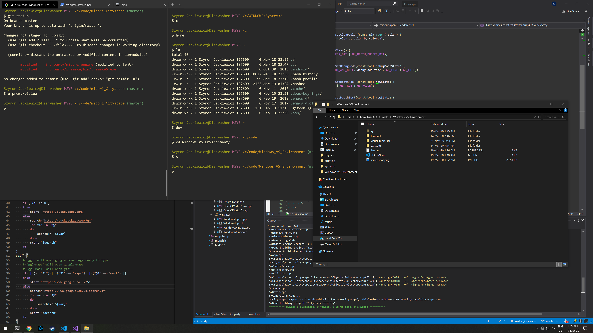

```
   _____               _  __          ___       _____  _           
  / ____|             | | \ \        / (_)     |  __ \(_)          
 | (___ _____   _     | |  \ \  /\  / / _ _ __ | |__) |_  ___ ___  
  \___ \_  / | | |_   | |   \ \/  \/ / | | '_ \|  _  /| |/ __/ _ \ 
  ____) / /| |_| | |__| |    \  /\  /  | | | | | | \ \| | (_|  __/ 
 |_____/___|\__, |\____/      \/  \/   |_|_| |_|_|  \_\_|\___\___| 
             __/ |                                                 
            |___/                                                  
```



# Visual Studio 2017
I still use 2017 as I have not gotten around to configuring 2019 properly.

### Key Extentions
 - ReSharper++ Ultimate 2019
 - Output enhancer
 
# VS Code
On Windows 10, configuration files can be found here:
```
C:\Users\username\AppData\Roaming\Code\User
```
Extentions are here:
```
C:\Users\username\.vscode\extensions
```

To apply these settings, copy the content accordingly.

# Windows Terminal
Configs for the [Windows Terminal](https://github.com/microsoft/terminal). This can be downloaded form the Microsoft Store.

This config assumes that [git bash](https://gitforwindows.org/) is installed.

1. Put the ```custom_icons``` directory somewhere and update the path to it in the ```profiles.json```.
2. Copy the ```profiles.json``` file into:
```
C:\Users\username\AppData\Local\Packages\Microsoft.WindowsTerminal_....\LocalState\
```

### Issues with XMouse
I like to use [Xmouse Button Control](https://www.highrez.co.uk/downloads/XMouseButtonControl.htm) and when XMBC is running, mouse scroll events are not propagated correctly to the terminal window. As a workaround to this, I have created a new profile for the terminal and set all options to "Same as Default". Then under the Options tab, enable the ```Disable Scroll Window Under Cursor``` option. This fixed this issue for me. (Thanks to: [yossizahn](https://github.com/microsoft/terminal/issues/2594))

# Bash RC
I like to navigate around my file system with short strings of letters that corespond to directories. Customise this to your uses at the bottom of the ```.bashrc``` file.

1. Set the path to your chosen text editor in the ```EDITOR_PATH``` variable.
2. Copy the ```.bashrc``` file to your home (```~```) directory.
